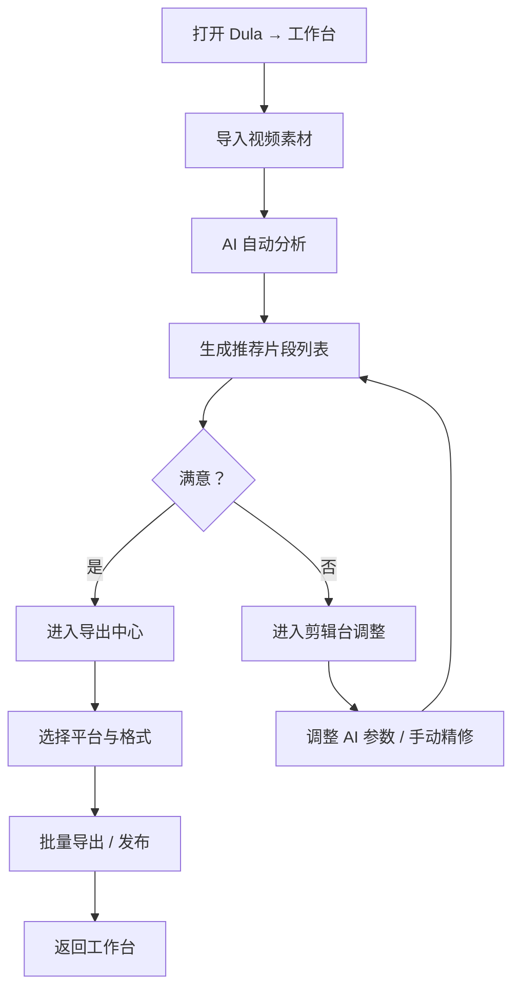

# Dula Auto Clip — 产品需求文档

## 1. 产品概述

Dula Auto Clip 是一款面向内容创作者的 AI 驱动自动剪辑工具，核心能力是将长视频智能拆解为多个高质量短视频片段。通过 AI 场景识别、语音情绪分析和节奏检测，自动提取视频中最具传播力的片段，并生成适配各社交平台的竖屏/横屏版本。目标用户为短视频创作者、自媒体运营者和 MCN 机构，需要在海量素材中快速产出内容。

## 2. 核心功能

### 2.1 用户角色

| 角色 | 注册方式 | 核心权限 |
|------|----------|----------|
| 免费用户 | 邮箱/手机号 | 每日 3 次自动剪辑、720p 导出 |
| Pro 用户 | 订阅制 | 无限剪辑、4K 导出、批量处理、自定义模板 |

### 2.2 功能模块

1. **工作台 (Workspace)**：素材导入、AI 分析状态、最近项目、快速操作
2. **剪辑台 (Clip Studio)**：AI 推荐片段预览、片段编辑、多轨道时间轴、AI 调整面板
3. **导出中心 (Export Hub)**：平台适配预览、批量导出、发布队列

### 2.3 页面详情

| 页面名称 | 模块名称 | 功能描述 |
|----------|----------|----------|
| Workspace | 素材导入区 | 拖拽上传视频文件，支持批量导入，显示文件信息与预估时长 |
| Workspace | AI 分析卡片 | 展示 AI 识别的场景数、情绪峰值、节奏节点，一键启动分析 |
| Workspace | 最近项目 | 网格展示最近处理的项目，含缩略图、状态标签、AI 评分 |
| Workspace | 快速操作 | 一键生成 Reels/TikTok/Shorts 格式，快速重剪 |
| Clip Studio | 片段时间轴 | 主视频轨道 + AI 推荐片段标记线 + 选中片段高亮区间 |
| Clip Studio | AI 推荐列表 | 侧边栏展示 AI 筛选的 Top 片段，含评分、类型标签、时长 |
| Clip Studio | 预览播放器 | 实时预览选中片段，支持逐帧、变速、循环播放 |
| Clip Studio | AI 调整面板 | 调整 AI 灵敏度、情绪权重、节奏偏好、场景类型过滤 |
| Clip Studio | 片段编辑器 | 裁剪/拼接/调色/字幕/音乐，针对单个片段的精修工具 |
| Export Hub | 平台预览 | 横竖屏切换预览，平台水印/字幕位置适配 |
| Export Hub | 批量导出 | 勾选多个片段，统一设置画质/格式/平台，一键导出 |
| Export Hub | 发布队列 | 导出任务进度、历史记录、重新下载 |

## 3. 核心流程

## 4. 用户界面设计

### 4.1 设计风格

- **主色调**：深空黑 #0D0D0F（底）+ 霓虹青 #00F0FF（主强调）+ 电流紫 #8B5CF6（辅助）+ 热力橙 #FF6B35（警示/评分）
- **按钮风格**：微圆角 6px，半透明玻璃质感边框，激活态霓虹发光效果
- **字体**：Space Grotesk（标题/数据）+ IBM Plex Mono（技术参数/标签）+ DM Sans（正文）
- **布局风格**：暗色科技仪表盘美学，卡片式分区，数据密度适中，AI 状态可视化
- **图标风格**：线性 Lucide 图标，1.5px 描边，霓虹色激活态
- **特效**：AI 分析时脉冲波纹动画、片段评分热力条、玻璃拟态面板

### 4.2 页面设计概述

| 页面 | 模块 | UI 元素 |
|------|------|---------|
| Workspace | 顶部导航 | Logo + 页面标签切换 + 用户头像，毛玻璃背景 |
| Workspace | 素材导入区 | 虚线边框拖拽区，渐变图标，文件信息 mono 字体 |
| Workspace | AI 分析卡片 | 深色卡片，霓虹进度环，场景/情绪/节奏三栏数据 |
| Workspace | 项目网格 | 圆角 12px 卡片，渐变缩略图，AI 评分热力条，状态徽章 |
| Clip Studio | 时间轴 | 深色轨道，霓虹标记线，选中片段发光边框，波形缩略图 |
| Clip Studio | AI 推荐列表 | 侧边栏卡片，评分圆环，类型标签（情绪/节奏/场景），时长标签 |
| Clip Studio | 预览播放器 | 深色舞台，霓虹播放按钮，时间码叠加，平台比例框线 |
| Clip Studio | AI 调整面板 | 玻璃拟态抽屉，滑块控件，权重雷达图，实时反馈 |
| Export Hub | 平台预览 | 手机/电脑外框，内容自适应，平台 Logo 标签 |
| Export Hub | 批量导出 | 勾选列表，统一设置面板，进度条队列 |

### 4.3 响应式与触控

- 桌面优先设计，最小视口 1280px
- 侧边栏可折叠适配中等屏幕
- 所有按钮 44px 以上触控区域
- 面板支持拖拽调整宽度

### 4.4 动画与微交互

- 页面切换：淡入 + 12px 右移，200ms
- AI 分析中：脉冲波纹 + 进度条流光动画
- 片段选中：霓虹边框渐入 + 轻微缩放
- 导出进度：流光扫描动画
- 卡片悬停：上浮 4px + 阴影加深 + 边框发光
