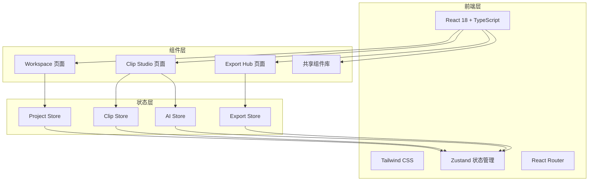

# Dula Auto Clip — 技术架构文档

## 1. 架构设计



## 2. 技术选型

- **前端框架**: React 18 + TypeScript
- **构建工具**: Vite
- **样式方案**: Tailwind CSS
- **状态管理**: Zustand
- **路由**: React Router DOM
- **图标**: Lucide React
- **动画**: Framer Motion
- **字体**: Google Fonts (Space Grotesk, IBM Plex Mono, DM Sans)

## 3. 路由定义

| 路由 | 用途 |
|------|------|
| / | Workspace 工作台 |
| /studio | Clip Studio 剪辑台 |
| /export | Export Hub 导出中心 |

## 4. 项目结构

```
src/
  components/
    TopNav.tsx
    ImportZone.tsx
    AIAnalysisCard.tsx
    ProjectCard.tsx
    ClipTimeline.tsx
    ClipCard.tsx
    PreviewPlayer.tsx
    AIAdjustPanel.tsx
    PlatformPreview.tsx
    ExportQueue.tsx
    ScoreRing.tsx
    GlassPanel.tsx
  pages/
    WorkspacePage.tsx
    ClipStudioPage.tsx
    ExportHubPage.tsx
  stores/
    projectStore.ts
    clipStore.ts
    exportStore.ts
    aiStore.ts
  types/
    index.ts
  App.tsx
  main.tsx
```

## 5. 数据模型

### 5.1 项目 (Project)

```typescript
interface Project {
  id: string;
  name: string;
  thumbnail: string;
  duration: number;
  resolution: string;
  status: 'analyzing' | 'ready' | 'editing' | 'exported';
  aiScore: number;
  clipCount: number;
  createdAt: Date;
}
```

### 5.2 片段 (Clip)

```typescript
interface Clip {
  id: string;
  projectId: string;
  startTime: number;
  endTime: number;
  name: string;
  type: 'emotion' | 'rhythm' | 'scene' | 'highlight';
  score: number;
  tags: string[];
  selected: boolean;
}
```

### 5.3 AI 分析结果 (AIAnalysis)

```typescript
interface AIAnalysis {
  projectId: string;
  sceneCount: number;
  emotionPeaks: number;
  rhythmBeats: number;
  sensitivity: number;
  emotionWeight: number;
  rhythmWeight: number;
  sceneFilter: string[];
  status: 'idle' | 'analyzing' | 'done';
  progress: number;
}
```

### 5.4 导出任务 (ExportTask)

```typescript
interface ExportTask {
  id: string;
  clipIds: string[];
  platform: 'tiktok' | 'reels' | 'shorts' | 'custom';
  quality: '720p' | '1080p' | '4k';
  format: 'mp4' | 'mov';
  status: 'queued' | 'exporting' | 'done' | 'failed';
  progress: number;
}
```

## 6. 状态管理设计

### 6.1 Project Store

```typescript
interface ProjectState {
  projects: Project[];
  addProject: (project: Project) => void;
  removeProject: (id: string) => void;
  updateProject: (id: string, updates: Partial<Project>) => void;
}
```

### 6.2 Clip Store

```typescript
interface ClipState {
  clips: Clip[];
  selectedClipId: string | null;
  selectClip: (id: string) => void;
  toggleClipSelection: (id: string) => void;
  updateClip: (id: string, updates: Partial<Clip>) => void;
}
```

### 6.3 AI Store

```typescript
interface AIState {
  analysis: AIAnalysis | null;
  setSensitivity: (value: number) => void;
  setEmotionWeight: (value: number) => void;
  setRhythmWeight: (value: number) => void;
  startAnalysis: () => void;
}
```

### 6.4 Export Store

```typescript
interface ExportState {
  tasks: ExportTask[];
  addTask: (task: ExportTask) => void;
  updateTask: (id: string, updates: Partial<ExportTask>) => void;
}
```
