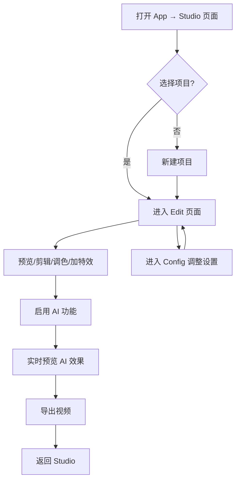

# NexClip 视频编辑器 — 产品需求文档

## 1. 产品概述

NexClip 是一款面向移动端的专业级视频编辑应用，以 AI 驱动的自动化功能为核心差异点，将 RIFE 补帧、RealESRGAN 超分辨率、Whisper 自动字幕、Demucs 音源分离、SAM2 目标追踪等 AI 能力无缝集成到剪辑工作流中。目标用户为追求效率与品质的内容创作者，需要在手机上完成从粗剪到精调再到 AI 增强的全流程。

## 2. 核心功能

### 2.1 用户角色

| 角色 | 注册方式 | 核心权限 |
|------|----------|----------|
| 普通用户 | 邮箱/第三方登录 | 基础剪辑、AI 功能有限次数 |
| 会员用户 | 订阅制 | 无限 AI 次数、4K 导出、高级调色 |

### 2.2 功能模块

1. **主页面 (Studio)**：项目列表、新建项目、分类筛选、AI 增强标记
2. **剪辑页面 (Edit)**：预览区、时间轴、播放控制、底部工具栏（剪辑/速度/调色/音频/特效/AI）、可展开面板
3. **设置页面 (Config)**：用户资料、项目默认设置、性能/AI 配置、外观、关于

### 2.3 页面详情

| 页面名称 | 模块名称 | 功能描述 |
|----------|----------|----------|
| Studio | 项目列表 | 网格/列表展示所有项目，含 AI 增强标记、时长、分辨率信息 |
| Studio | 新建项目 | 快速创建新项目入口 |
| Studio | 分类标签 | 全部/草稿/已完成/AI 增强 筛选 |
| Edit | 预览区 | 视频实时预览，叠加 AI 就绪指示器、时间码、分辨率信息 |
| Edit | 时间轴 | 多轨道（视频/音频/字幕），播放头，轨道标签 |
| Edit | 播放控制 | 播放/暂停、快进快退、逐帧、时间显示 |
| Edit | 工具栏 | 底部 6 格工具：剪辑/速度/调色/音频/特效/AI |
| Edit | 剪辑面板 | 分割/删除/裁剪/旋转/画中画/倒放 |
| Edit | 速度面板 | 速度曲线编辑器（线性/缓入/缓出/缓入出/弹性/自定义），速度倍率 |
| Edit | 调色面板 | AE Lumetri 风格：基础/曲线/色轮/HSL 四 Tab，含示波器 |
| Edit | 音频面板 | 音量/淡入淡出/降噪等级 |
| Edit | 特效面板 | 转场/光效/模糊/故障/风格化/变形 |
| Edit | AI 面板 | 6 个 AI 模型开关卡片：补帧/超分/降噪/分离/字幕/追踪 |
| Config | 用户资料 | 头像、昵称、邮箱 |
| Config | 项目设置 | 默认画质/导出格式/水印/存储位置 |
| Config | 性能设置 | GPU 加速/AI 推理精度/缓存管理 |
| Config | 外观设置 | 深色模式/字体 |
| Config | 关于 | 版本号/反馈入口 |

## 3. 核心流程

## 4. 用户界面设计

### 4.1 设计风格

- **主色调**：暖纸色 #F2EFE9（底）+ 墨黑 #0A0A0A（字/线）+ 朱红 #FF3D00（强调）+ 柠黄 #FFD600（辅助）
- **按钮风格**：硬边直角，1.5px 实线边框，无圆角，激活态填充墨黑
- **字体**：Fraunces（衬线展示标题，斜体强调）+ JetBrains Mono（技术数据/时间码/标签）+ Inter Tight（正文）
- **布局风格**：编辑手稿/印刷美学，高密度信息排版，编号索引系统
- **图标风格**：极简几何符号，等宽字体替代图标

### 4.2 页面设计概述

| 页面 | 模块 | UI 元素 |
|------|------|---------|
| Studio | Hero | 巨型衬线标题"MAKE VIDEO BOLD"，斜体强调词，mono 编号标签 |
| Studio | 数据元 | 三栏统计：Projects/Storage/AI Credits，mono 字体 |
| Studio | 项目列表 | 硬边卡片，渐变缩略图，AI 徽章，mono 时间/分辨率信息 |
| Studio | 底部导航 | 三格等分，编号 01/02/03，双语标签 |
| Edit | 预览区 | 墨黑底舞台，时间码叠加，AI READY 标签，LIVE PREVIEW 脉冲点 |
| Edit | 时间轴 | 多轨道，mono 轨道标签 V1/V2/A1/A2，虚线边框片段 |
| Edit | 工具栏 | 底部 6 格，mono 图标 + 大写上标签 |
| Edit | 调色面板 | 四 Tab（Basic/Curves/Wheels/HSL），SVG 曲线编辑器，conic-gradient 色轮 |
| Edit | AI 面板 | 6 个开关卡片，mono 技术参数，硬边开关 |
| Config | 标题 | 巨型衬线"SET TINGS"，斜体分割 |
| Config | 设置列表 | 分组标题（mono 大写），硬边列表项，开关/箭头/数值 |

### 4.3 响应式与触控

- 固定 393×852 手机视口模拟
- 所有按钮 44px 以上触控区域
- 面板滑动展开/收起动画
- 时间轴支持横向拖拽 scrub

### 4.4 动画与微交互

- 页面切换：淡入 + 8px 上移
- 面板展开：translateY 缓动 300ms
- 播放按钮：按下缩放 0.9
- AI 脉冲点：1.4s 呼吸动画
- 列表项悬停：左侧 3px 朱红指示线
