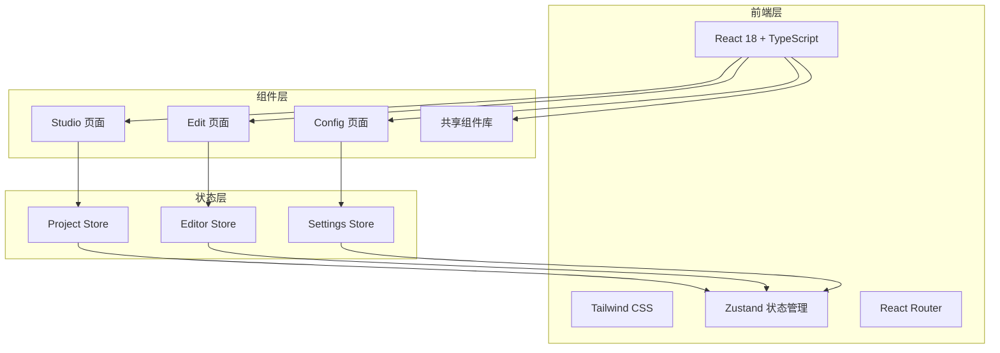

# NexClip 视频编辑器 — 技术架构文档

## 1. 架构设计



## 2. 技术选型

- **前端框架**: React 18 + TypeScript
- **构建工具**: Vite
- **样式方案**: Tailwind CSS
- **状态管理**: Zustand
- **路由**: React Router DOM
- **图标**: Lucide React
- **字体**: Google Fonts (Fraunces, JetBrains Mono, Inter Tight)

## 3. 路由定义

| 路由 | 用途 |
|------|------|
| / | Studio 主页 |
| /editor/:id | 剪辑页面 |
| /settings | 设置页面 |

## 4. 项目结构

```
src/
  components/
    StatusBar.tsx
    BottomNav.tsx
    ProjectCard.tsx
    AIToggleCard.tsx
    ColorSlider.tsx
    SpeedCurve.tsx
    ColorWheel.tsx
    Scope.tsx
    ToolButton.tsx
    Panel.tsx
  pages/
    StudioPage.tsx
    EditorPage.tsx
    SettingsPage.tsx
  stores/
    projectStore.ts
    editorStore.ts
    settingsStore.ts
  types/
    index.ts
  App.tsx
  main.tsx
```

## 5. 数据模型

### 5.1 项目 (Project)

```typescript
interface Project {
  id: string;
  name: string;
  thumbnail: string;
  duration: number;
  resolution: string;
  fps: number;
  aiEnhanced: boolean;
  aiFeatures: string[];
  status: 'draft' | 'done';
  createdAt: Date;
  updatedAt: Date;
}
```

### 5.2 时间轴轨道 (Track)

```typescript
interface Track {
  id: string;
  type: 'video' | 'audio' | 'text';
  label: string;
  clips: Clip[];
}

interface Clip {
  id: string;
  start: number;
  end: number;
  name: string;
  style?: 'solid' | 'dashed';
}
```

### 5.3 AI 功能 (AIFeature)

```typescript
interface AIFeature {
  id: string;
  name: string;
  description: string;
  model: string;
  enabled: boolean;
  icon: string;
}
```

### 5.4 设置 (Settings)

```typescript
interface Settings {
  defaultQuality: '720p' | '1080p' | '4K';
  exportFormat: 'mp4' | 'mov';
  watermark: boolean;
  storageLocation: 'internal' | 'external';
  gpuAcceleration: boolean;
  aiPrecision: 'fp32' | 'fp16' | 'int8';
  darkMode: boolean;
  font: 'editorial' | 'modern';
}
```

## 6. 状态管理设计

### 6.1 Project Store

```typescript
interface ProjectState {
  projects: Project[];
  activeTab: 'all' | 'draft' | 'done' | 'ai';
  addProject: (project: Project) => void;
  deleteProject: (id: string) => void;
  setActiveTab: (tab: string) => void;
}
```

### 6.2 Editor Store

```typescript
interface EditorState {
  currentProject: Project | null;
  currentTime: number;
  isPlaying: boolean;
  activePanel: string | null;
  activeTool: string | null;
  colorGradingTab: 'basic' | 'curve' | 'wheel' | 'hsl';
  speedCurveType: string;
  aiFeatures: AIFeature[];
  setCurrentTime: (time: number) => void;
  togglePlay: () => void;
  openPanel: (panel: string) => void;
  closePanel: () => void;
  toggleAIFeature: (id: string) => void;
}
```

### 6.3 Settings Store

```typescript
interface SettingsState {
  settings: Settings;
  updateSetting: (key: keyof Settings, value: any) => void;
  resetSettings: () => void;
}
```
